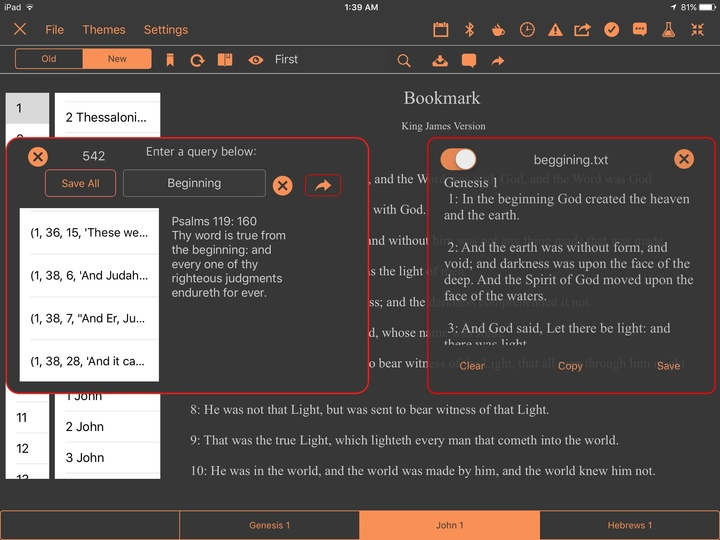

A redesign of the Bible App I created [here](https://github.com/TutorialDoctor/Pythonista-Projects/tree/master/Projects/Apps/Basic%20Bible)

Creating a **Bible App** with **Pythonista** to learn how to use the Sqlite3 module.

~~`[Video Demo]()~~

Database from [here](https://github.com/scrollmapper/bible_databases)

The only files you need currently are `the_bible.py`, `the_bible.pyui`, `bible-sqlite.db`.

This project will demonstrate how to:

1. Query an SQlite database with Python
2. Load data from a database into Pythonista's **ui.View()**s
3. File handling with Python
4. Using the **sound** module
5. Creating alerts using the **console** module
6. Work with the **TableView** module and pass data from one to another
7. Use the **datetime** module to create a timestamp
8. Use the **lambda** function
9. Use list **comprehension**
10. Using segmented controls

